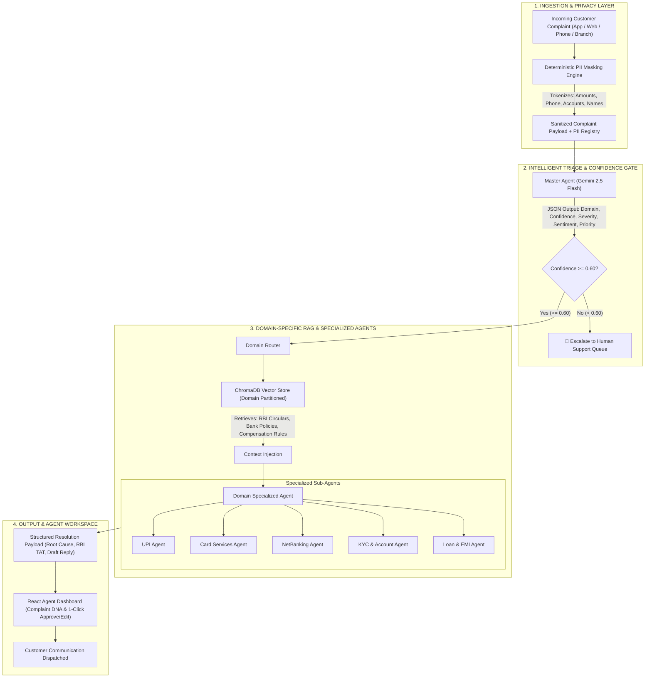

# ResolveIQ — Multi-Agent Banking Complaint Triage & RAG Resolution Platform

[](https://fastapi.tiangolo.com/)
[](https://reactjs.org/)
[](https://ai.google.dev/)
[](https://www.trychroma.com/)
[-blueviolet)](https://huggingface.co/sentence-transformers/all-MiniLM-L6-v2)
[](https://tailwindcss.com/)

---

## 📌 Executive Summary

**ResolveIQ** is an enterprise-grade, privacy-first **FinTech Customer Resolution Engine** built for banking and financial institutions. Modern banks receive thousands of multi-channel complaints daily (UPI failures, fraudulent credit card transactions, unauthorized debits, KYC lockouts, and EMI discrepancies). Handling these manually creates massive operational backlogs, customer churn, and severe regulatory non-compliance risks under Reserve Bank of India (RBI) mandates.

ResolveIQ bridges this gap by combining **Deterministic PII Sanitization**, **LLM-powered Domain Classification**, **Domain-Partitioned Vector RAG (Retrieval-Augmented Generation)**, and **Specialized Autonomous Sub-Agents** with a **Human-in-the-Loop Agent Dashboard**.

---

## 🚀 Key Benefits & Business Impact

| Metric / Objective | Traditional Support | ResolveIQ Support |
|---|---|---|
| **First Response Time (FRT)** | 4–24 hours | **< 2 seconds** (Draft ready for agent review) |
| **Data Privacy & PII Leakage** | High risk of exposing sensitive data | **Zero PII Leakage** (Tokenized before reaching LLM) |
| **Regulatory Compliance** | Manual SLA & TAT calculations | **Automated RBI Mandate & TAT Enforcement** |
| **Resolution Consistency** | Varies by agent expertise | **Grounded in Verified Domain Policy Knowledge Bases** |
| **Agent Fatigue & Duplicates** | Repetitive manual ticket responses | **Smart Incident Clustering & One-Click Bulk Resolution** |
| **Failure Handling** | Unpredictable halluncinations | **Confidence-Gated Escalation (< 60% confidence ➔ Human)** |

---

## 🏛️ System Architecture



---

## 🧩 Architectural Deep Dive

### 1. Zero-Leakage PII Masking (`master_agent.py`)
Customer complaints routinely contain sensitive financial identifiers. Before any text is passed to external LLM APIs, ResolveIQ executes deterministic tokenization:
- **Currency Amounts**: `₹15,000` ➔ `[AMT_1]`
- **Indian Phone Numbers**: `9876543210` ➔ `[PHONE_1]`
- **Account Numbers**: `459812349876` ➔ `[ACCT_1]`
- **Customer Names**: `Rajesh Kumar` ➔ `[NAME_1]`
- The isolated `pii_registry` is maintained in-memory on the backend and never exposed to the LLM context.

### 2. Multi-Agent Triage & Confidence Gate (`master_agent.py`)
The master orchestrator prompts `gemini-2.5-flash` using strict JSON schema enforcement to extract:
- **Domain**: `UPI` | `CreditDebit` | `NetBanking` | `KYC` | `Loans`
- **Confidence Score**: Quantitative score ($0.0 \dots 1.0$).
- **Severity**: `Critical` (funds debited/fraud), `Medium` (service access), `Low` (inquiry).
- **Customer Sentiment**: `Very Angry` | `Angry` | `Neutral` | `Satisfied`.
- **Priority**: Integer scale (1–10) calculated from severity and monetary risk.
- **Fail-Safe Gate**: If confidence falls below $0.60$, the system bypasses auto-resolution and routes directly to senior human personnel.

### 3. Partitioned ChromaDB Vector RAG Engine (`rag_engine.py`)
Rather than maintaining a bloated, monolithic vector database, ResolveIQ isolates policies into **domain-specific vector collections** (`resolveiq_upi`, `resolveiq_credit_debit`, etc.):
- **Embedding Model**: Local `SentenceTransformer` (`all-MiniLM-L6-v2`) for zero-cost, high-speed semantic embeddings.
- **Chunking**: `RecursiveCharacterTextSplitter` with 300-token chunk size and 50-token overlap.
- **Knowledge Base**: Encodes statutory RBI mandates, including:
  - UPI auto-reversal timeline ($T+1$ day) and ₹100/day delay compensation.
  - Credit card unauthorized transactions zero-liability rules ($3$-day reporting window).
  - Net banking lockout procedures and IMPS/NEFT turnaround times.
  - Re-KYC intervals and Account unfreezing TAT (7 working days).
  - Loan EMI duplicate debit reversal SLAs and foreclosure charges.

### 4. Specialized Domain Sub-Agents (`agents/`)
Each domain sub-agent possesses focused system prompts designed to generate:
1. **1-Line Root Cause Analysis**: Technical explanation of why the failure occurred.
2. **Empathetic & Formal Customer Communication**: Personalized, non-hallucinatory reply.
3. **Statutory RBI Resolution Timeline (TAT)**: Exact turnaround commitment as per regulatory rules.

### 5. Enterprise Agent Dashboard (`Agent Dashboard/`)
A high-performance React 18 Single-Page Application (SPA):
- **Live AI Complaint Processor Modal**: Real-time multi-agent execution visualizer showing PII masking, Gemini scoring, ChromaDB retrieval, and response generation.
- **Complaint DNA Inspection**: Full visualization of category, priority, sentiment, and RBI risk score.
- **AI Draft Reply Editor**: Review, tweak, and 1-click approve AI responses.
- **Incident Clustering & Duplicate Detection**: Semantic clustering for mass outage events (e.g. 47 UPI timeout complaints during 7–9 PM peak load) with bulk resolution dispatch.
- **System Health Monitor**: Real-time polling indicator verifying FastAPI connectivity.

---

## 📂 Repository Structure

```
.
├── Agent Dashboard/                  # Frontend (React 18 + Vite + TypeScript + Tailwind)
│   ├── public/
│   │   └── _redirects                # Netlify/Cloudflare SPA redirect fallback
│   ├── src/
│   │   ├── components/
│   │   │   ├── AppSidebar.tsx        # Dashboard navigation sidebar
│   │   │   ├── NewComplaintModal.tsx # Live AI RAG pipeline test modal
│   │   │   ├── TopNavbar.tsx         # Agent profile & Live API health badge
│   │   │   └── ui/                   # Radix UI + shadcn primitive components
│   │   ├── data/
│   │   │   └── mockData.ts           # Mock & localized state persistence layer
│   │   ├── lib/
│   │   │   └── api.ts                # Typesafe backend API client
│   │   ├── pages/
│   │   │   ├── HomePage.tsx          # Analytics, SLA metrics, volume trends
│   │   │   ├── ComplaintsPage.tsx    # Complaint feed with multi-filter & live creation
│   │   │   ├── ComplaintDetail.tsx   # Complaint DNA, PII viewer & live regenerate
│   │   │   ├── DuplicatesPage.tsx    # Incident clustering & bulk resolution
│   │   │   └── LoginPage.tsx         # Agent authentication portal
│   │   ├── App.tsx                   # App router & TanStack query client
│   │   └── main.tsx
│   ├── package.json
│   ├── vercel.json                   # Vercel SPA routing rewrite configuration
│   └── vite.config.ts
│
├── resolveiq-rag/                    # Backend (FastAPI + LangChain + ChromaDB + Gemini)
│   ├── agents/                       # Specialized Domain Agents
│   │   ├── credit_debit_agent.py
│   │   ├── kyc_agent.py
│   │   ├── loans_agent.py
│   │   ├── netbanking_agent.py
│   │   └── upi_agent.py
│   ├── knowledge_base/               # RBI Banking Policy Knowledge Bases (.txt)
│   │   ├── credit_debit.txt
│   │   ├── kyc.txt
│   │   ├── loans.txt
│   │   ├── netbanking.txt
│   │   └── upi.txt
│   ├── api.py                        # FastAPI Async REST API service
│   ├── master_agent.py               # PII masking, Gemini triage & agent orchestrator
│   ├── rag_engine.py                 # ChromaDB vector store builder & retriever
│   ├── main.py                       # CLI test suite for automated complaint verification
│   ├── requirements.txt              # Python dependency manifest
│   ├── Dockerfile                    # Container definition for cloud deployment
│   ├── Procfile                      # PaaS process file (Railway/Render)
│   └── render.yaml                   # Render infrastructure-as-code blueprint
│
└── README.md                         # Project Master Documentation
```

---

## 🛠️ Local Development Guide

### Prerequisites
- Node.js 18+ and npm
- Python 3.10+
- Google Gemini API Key ([Get a free key here](https://aistudio.google.com/))

---

### Step 1: Start the Backend Service

```bash
cd resolveiq-rag

# 1. Create and activate a Python virtual environment
python3 -m venv venv
source venv/bin/activate        # On Windows: venv\Scripts\activate

# 2. Install dependencies
pip install -r requirements.txt

# 3. Configure your API key
echo "GEMINI_API_KEY=your_actual_gemini_api_key" > .env

# 4. Start the FastAPI server
uvicorn api:app --reload --port 8000
```
- **API Server**: `http://localhost:8000`
- **Interactive Swagger Docs**: `http://localhost:8000/docs`
- **Health Check**: `http://localhost:8000/health`

---

### Step 2: Start the Frontend Dashboard

Open a second terminal window:

```bash
cd "Agent Dashboard"

# 1. Install packages
npm install

# 2. Run the Vite development server
npm run dev
```
- **Frontend URL**: `http://localhost:8080`
- The top navbar will display **`● Live AI Backend`** indicating successful connection to the Python RAG server.

---

## 📡 REST API Reference

### `POST /api/process-complaint`
Executes complete PII masking, LLM classification, ChromaDB retrieval, and domain resolution.

**Request Payload:**
```json
{
  "customer_name": "Rajesh Kumar",
  "complaint": "I made a UPI payment of ₹15000 to Suresh Mehta but money was debited and not received. Transaction ID TXN9834521. Please help urgently."
}
```

**Response Payload:**
```json
{
  "status": "resolved",
  "customer_name": "Rajesh Kumar",
  "original_complaint": "I made a UPI payment of ₹15000 to Suresh Mehta...",
  "masked_complaint": "I made a UPI payment of [AMT_1] to Suresh Mehta...",
  "pii_registry": {
    "AMT_1": "₹15000",
    "NAME_1": "Rajesh Kumar"
  },
  "classification": {
    "domain": "UPI",
    "confidence": 0.95,
    "severity": "Critical",
    "sentiment": "Very Angry",
    "priority": 9
  },
  "rag_context_used": "UPI Transaction Failure Policy: If UPI payment fails and money is debited...",
  "agent_response": "1. Root Cause: UPI switch timeout during peak traffic window.\n2. Dear Rajesh Kumar, We have verified transaction TXN9834521. An auto-reversal of ₹15,000 has been initiated to your account.\n3. Resolution TAT: In accordance with RBI mandate, funds will reflect within T+1 working day with auto-compensation if delayed.",
  "domain": "UPI"
}
```

---

## 🛡️ Security & Privacy Guardrails

- **Zero Data Ingestion by Third-Party Models**: Sanitization executes on local CPU regex before payload transit.
- **Fail-Closed Gatekeeper**: Ambiguous queries trigger instant human handoff rather than hallucinated policies.
- **Local Embedding Execution**: All vector similarity searches are computed on-premise/in-container using `all-MiniLM-L6-v2`.

---

## 📜 License
This project is open-source and available under the [MIT License](LICENSE).
